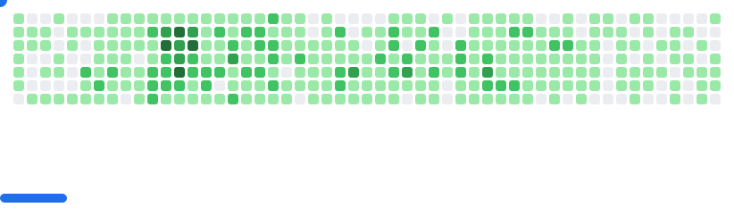

<h1 align="center">Hi 👋, I'm Giorgi Chkhikvadze</h1>
<h3 align="center">Full Stack Engineer & CTO with 4+ years of experience building scalable web applications and enterprise systems</h3>

  

  

- 🏗️ Building enterprise platforms
- 💬 Ask me about **React, Next.js, NestJS, Node.js, TypeScript, PostgreSQL, Docker, Turborepo**
- 📫 How to reach me **gchkhiikvadze@gmail.com**
- 👨‍💻 All of my projects are available at [github.com/chkhikvadzeg](https://github.com/chkhikvadzeg)
- 📄 Know about my experiences [linkedin.com/in/chkhikvadzeg](https://linkedin.com/in/chkhikvadzeg)

---

### 🚀 Key Projects

| Project | Description | Stack |
|---------|-------------|-------|
| **KODA** | Fleet & agricultural operations management — vehicle tracking, poultry farms, feed production, warehouse inventory, RS.ge waybills, FINA integration | NestJS, React 19, PostgreSQL, Prisma, Turborepo, WebSockets, PWA |
| **CAI RS** | Tax declaration automation & invoice management for Georgian businesses via RS.ge | NestJS, React 19, Puppeteer, BullMQ, Redis, PostgreSQL |
| **MASO ERP** | Manufacturing ERP for iron & stone factories — orders, production workflows, inventory | NestJS, React 19, Socket.IO, Prisma, PostgreSQL, Docker |
| **IBSU** | University management system — 37+ admin modules, course registration, grading, attendance | React, Node.js/Express, Prisma, TypeScript, Jenkins CI/CD |
| **Pointment** | Salon booking platform with custom time-slot algorithm & Stripe payments | Node.js, React, Fastify, GraphQL, Prisma, Amazon Cognito |
| **Belux** | E-commerce furniture platform with real-time updates & recommendations | React, Node.js, Express, PostgreSQL, Prisma |
| **Picnic** | Social app admin panel — moderation, analytics, user management | Go, React, GraphQL, Apollo |
| **AI Farmer** | Smart agriculture — remote warehouse control (irrigation, lighting) | Full Stack |

---

<h3 align="left">Connect with me:</h3>

---

<h3 align="left">Languages and Tools:</h3>

**Frontend**

**Backend**

**Databases & Infrastructure**

**Testing & Tools**

---

&nbsp;

<picture>
  <source
    media="(prefers-color-scheme: dark)"
    srcset="images/breakout-dark.svg"
  />
  <source
    media="(prefers-color-scheme: light)"
    srcset="images/breakout-light.svg"
  />
  
</picture>
